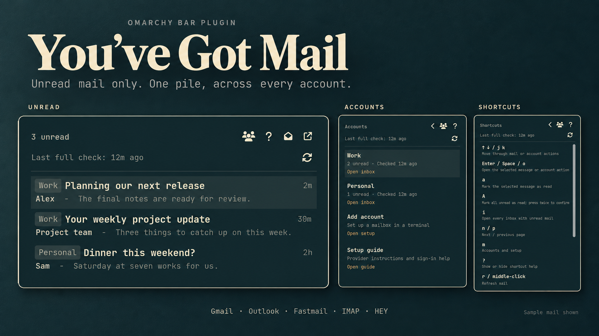
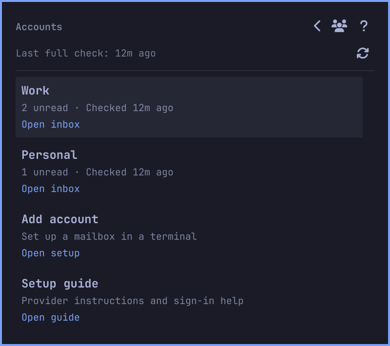
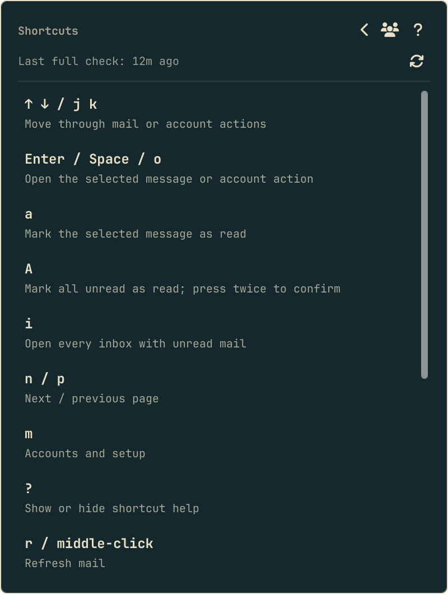
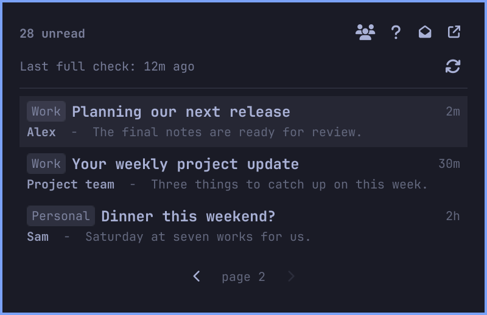
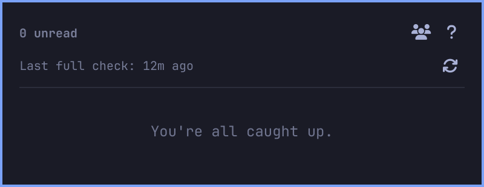

# You've Got Mail

An Omarchy bar widget for **unread mail only**. One pile, across every
account you add. Click a row to open that message in the browser. Read
mail is never listed.

Gmail, Outlook, Fastmail, generic IMAP, and HEY are built in. Adding
another provider is documented in [docs/PROVIDERS.md](docs/PROVIDERS.md).
**Account setup lives in [docs/ACCOUNTS.md](docs/ACCOUNTS.md)** — start
there for Outlook.com, Gmail OAuth, or HEY.

## Preview

Version 2.8.0 overview, composed from screenshots with sample mail only.

<p align="center">
  
</p>

<p align="center">
  
  &nbsp;&nbsp;
  
</p>

<p align="center">
  
  &nbsp;&nbsp;
  
</p>

## Requirements

- [Omarchy](https://omarchy.org/) 4.0 or later (plugin `schemaVersion` 1)
- `python3` (and `jq` for the Gmail provider)
- **Gmail:** [Google Workspace CLI][gws] — `gws auth setup` (or a Desktop
  OAuth client JSON), then
  `GOOGLE_WORKSPACE_CLI_KEYRING_BACKEND=file gws auth login -s gmail`.
  Full steps in [docs/ACCOUNTS.md](docs/ACCOUNTS.md#gmail).
- **HEY:** [hey-cli][hey-cli] — `hey auth login`
- **Outlook:** a Microsoft Graph app registration *you* own. Personal
  `outlook.com` mailboxes need OAuth; this plugin supports it through Graph,
  not its password-based IMAP provider. Creating the Azure directory
  usually asks for a card; app registration itself is free. Details in
  [docs/ACCOUNTS.md](docs/ACCOUNTS.md#outlook).
- **Fastmail / IMAP:** an API token or app password

The bar is not a login shell. The plugin already looks in
`~/.local/share/mise/shims`, `~/.local/bin`, and `~/.bun/bin` for `gws`
and `hey`.

## Install

```bash
omarchy plugin add https://github.com/BVisagie/omarchy-you-got-mail.git --enable
omarchy bar move bvisagie.you-got-mail --section right
```

No sudo or pkexec is required. Omarchy clones the repo, validates the
manifest, and enables the widget. Review the checkout before enabling if
you did not pass `--enable`.

## Update

```bash
omarchy plugin update bvisagie.you-got-mail
```

Omarchy fetches the latest commit and prints a diff of what would
change. If that opens a pager, space pages through the diff and `q`
leaves it. After the diff, confirm the update.

To skip the diff and confirmation:

```bash
omarchy plugin update bvisagie.you-got-mail --yes
```

That fast-forwards the git checkout in
`~/.config/omarchy/plugins/bvisagie.you-got-mail/`. It does not rewrite
`~/.config/omarchy-you-got-mail/` (accounts and secrets). See
[CHANGELOG.md](CHANGELOG.md) for what changed in each release.

Version 2.8.0 uses your existing accounts and widget settings; no migration
or new sign-in is required unless a provider's login has expired. Plugin
changes reload automatically. Last-check times start fresh after a reload.

## Accounts

```bash
PLUGIN=~/.config/omarchy/plugins/bvisagie.you-got-mail/bin/you-got-mail

$PLUGIN accounts add gmail
$PLUGIN accounts add hey
$PLUGIN accounts add outlook
$PLUGIN accounts add fastmail
$PLUGIN accounts add imap
$PLUGIN accounts login gmail
$PLUGIN accounts
```

Use **Accounts (`m`) → Add account** to open the existing setup wizard in
a floating terminal. You can also run `accounts add` and `accounts login`
in a **terminal**. The panel never handles credentials. Outlook opens a
browser tab; Gmail and HEY sign in through their own CLIs.
`accounts login` re-authenticates an existing id in place
when a token expires.

If you never add an account, a single Gmail account is assumed. The first
*extra* account (Outlook, HEY, …) writes that implicit Gmail into
`accounts.json` so it stays on the pile.

## Using it

| | |
|---|---|
| Click the bar icon | open or close the panel |
| Right-click the bar icon | open each inbox that currently has unread (one tab per account) |
| Middle-click the bar icon, refresh button, or `r` | refresh now |
| Accounts button or `m` | account counts, individual inbox links, Add account, setup guide |
| Help button or `?` | keyboard and mouse controls |
| Header envelope-open or `A` | mark all unread as read (click or press twice to confirm) |
| `a` | mark the message under the cursor as read, without opening it |
| Header external-link or `i` | same as right-click |
| Click a message | open **that** thread in the browser and take it off the pile |
| `↑` `↓` or `j` `k` | move through mail or account actions; scroll help |
| `Enter`, `Space` or `o` | open the selected message or account action |
| `n` / `p` | next page, previous page |
| `Tab` / `Shift+Tab` | switch to the next or previous bar panel |
| `x` or action-error × | dismiss an action error |
| `Esc` | return from Accounts/Help, cancel mark-all confirm, or close |

The bar tooltip shows the unread count, or why mail needs attention. A
`!` on the mailbox means mail needs attention, not unread mail.

**Accounts** keeps the merged unread list as your main view. It shows each
account's current count and opens just that inbox, even if it has no unread
mail. Accounts without a webmail URL cannot be opened. Failed accounts say
**Unavailable** rather than displaying a zero count.

The panel and tooltip show the **last full check**. Accounts lists each
mailbox's last successful check; a failed mailbox keeps its previous time.
Partial success never advances the full-check time. These times are held in
memory and start fresh when the plugin reloads. Press `r` or the refresh button
to check again; changing relative time labels does not fetch mail.

The panel refreshes on the interval from widget settings (default one
minute), and again when you open it or click a row. With more than one
account the badge is the sum of unread, rows are newest-first, and each
row shows an account chip. If one account fails, the others still show
and the panel names the failure, including when the healthy mailboxes
are empty. Expired OAuth tokens become **Gmail needs you to sign in
again** plus the sign-in command
(`~/.config/omarchy/plugins/bvisagie.you-got-mail/bin/you-got-mail accounts login gmail`,
or `you-got-mail accounts login gmail` once you have linked it onto
PATH), not the raw `invalid_grant` dump. Click the command (or ▶) to run
it in a floating terminal, or ⧉ to copy it. This works for every
provider. When a provider's CLI is missing, **Open setup guide** opens
its section of [docs/ACCOUNTS.md](docs/ACCOUNTS.md).

If marking a message read fails, its row and count are restored and the panel
shows the error, including after reopening. Browser opening still happens
immediately. The latest action warning or error replaces the previous notice.
Dismiss it with × or `x`; a successful mark-all without warnings also clears it.

The unread badge is the provider's mailbox total, not just the rows on
this page. Merged paging walks a cap of 200 newest messages across
accounts. Mark-all as read uses the same mailbox total: it is not limited
to the current page.

## Configuration

Page size and refresh interval are **bar widget settings** on the
`bvisagie.you-got-mail` entry in `~/.config/omarchy/shell.json` (Omarchy's
widget settings UI writes the same keys):

| Key | Default | Range |
|---|---|---|
| `max` | 25 | 1–50 (messages per panel page) |
| `refreshIntervalSec` | 60 | 15–3600 |

Accounts, tokens, and passwords stay in
`~/.config/omarchy-you-got-mail/` — they do not belong in `shell.json`.
An optional leftover `~/.config/omarchy-you-got-mail/config` with
`max = 25` is still honoured by the CLI when you run `list` without
`--limit`; the panel always passes `--limit` from widget settings.

CLI also honours `YOU_GOT_MAIL_MAX`. See [docs/ACCOUNTS.md](docs/ACCOUNTS.md)
and [docs/PROVIDERS.md](docs/PROVIDERS.md) for `YOU_GOT_MAIL_IMAP_PASSWORD`
and provider environment.

## Removing it

```bash
omarchy plugin remove bvisagie.you-got-mail
```

That does not delete `~/.config/omarchy-you-got-mail/` (accounts and
secrets) or `~/.cache/omarchy-you-got-mail/`. Remove those yourself if
the machine is changing hands.

| Provider | Sign out |
|---|---|
| Gmail | `gws auth logout` |
| HEY | `hey auth logout` |
| Outlook Graph | delete `secrets/outlook.json` and remove the app at [account.live.com/consent](https://account.live.com/consent) (personal) or the Azure app's permissions |

## License

MIT

[gws]: https://github.com/googleworkspace/cli
[hey-cli]: https://github.com/basecamp/hey-cli
